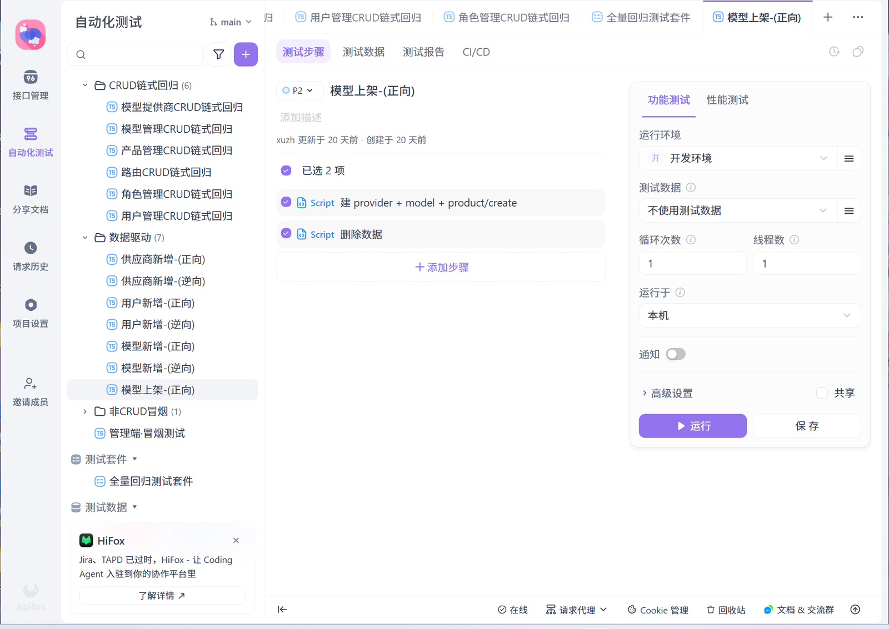
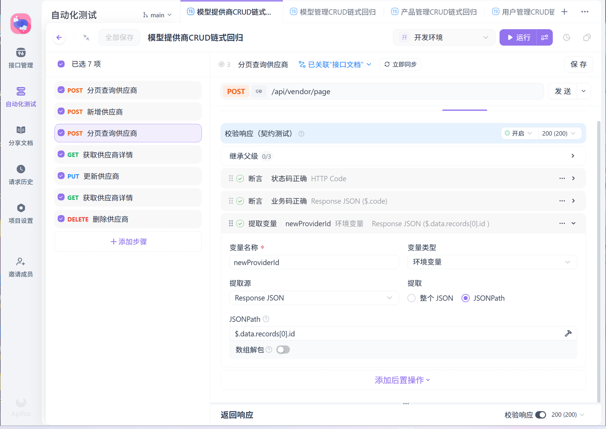
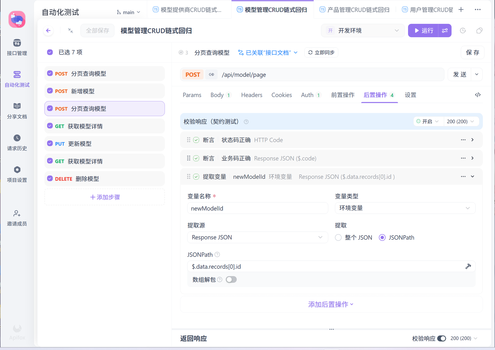
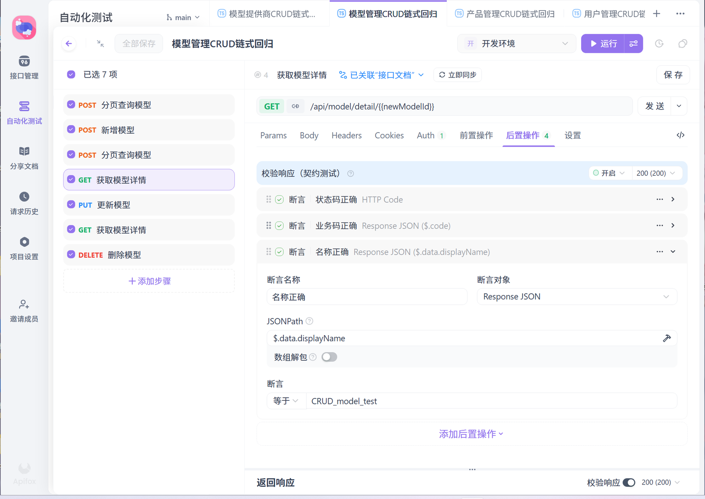
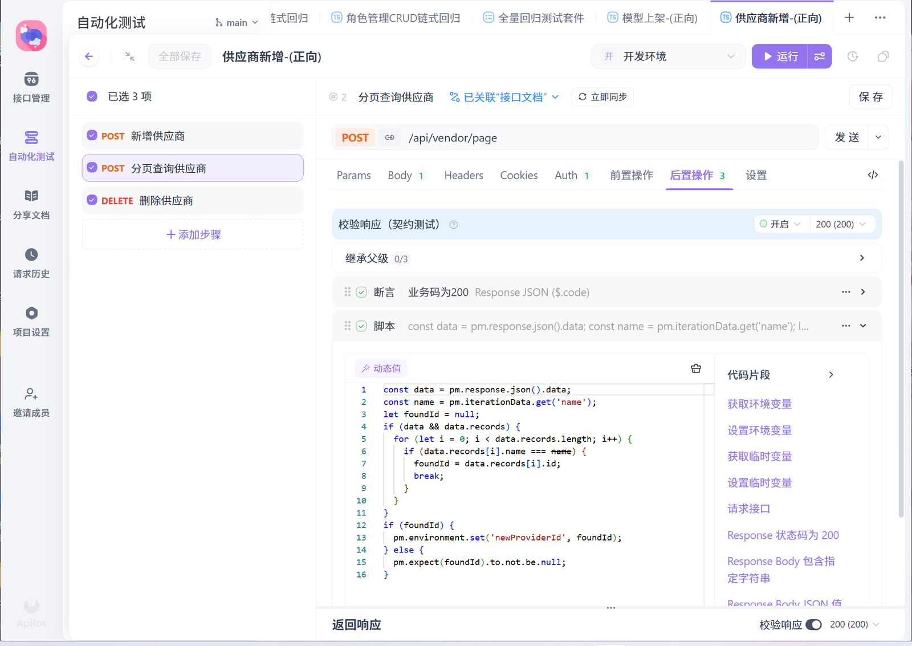
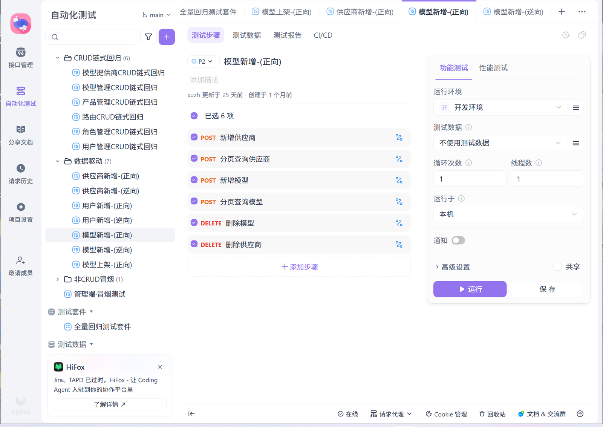
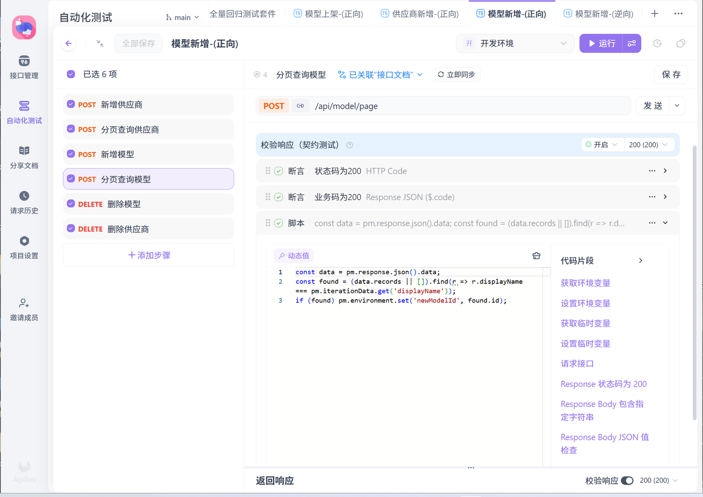

# 接口自动化测试（Apifox）

基于 **Apifox 测试场景**构建的管理端接口自动化回归，覆盖 CRUD 链式回归、数据驱动
边界回归与冒烟测试三类，共 **14 个测试场景**，通过 Runner 定时执行并留存测试报告。

**规模：14 个测试场景 / 6 类资源 / 60+ 个测试步骤 / 162 份执行报告**

---

## 一、场景总览

### 1. CRUD 链式回归（6 个场景）

覆盖 6 类核心资源的「查 → 增 → 查 → 详情 → 改 → 详情验改 → 删」全链路，
单场景 7 个步骤，步骤之间通过环境变量传递资源 ID。

| 场景 | 覆盖资源 | 步骤数 |
|---|---|---:|
| 模型提供商 CRUD 链式回归 | 模型提供商 | 7 |
| 模型管理 CRUD 链式回归 | 模型 | 7 |
| 产品管理 CRUD 链式回归 | 模型产品 | 7 |
| 路由 CRUD 链式回归 | 模型路由 | 7 |
| 角色管理 CRUD 链式回归 | 角色 | 7 |
| 用户管理 CRUD 链式回归 | 用户 | 7 |

**链式步骤设计**（以模型管理为例）：

```
① 分页查询模型          POST /api/model/page
② 新增模型              POST /api/model/add          → 提取 newModelId
③ 分页查询模型          POST /api/model/page         → 按名称匹配取真实 ID
④ 获取模型详情          GET  /api/model/detail/{newModelId}
⑤ 更新模型              PUT  /api/model/update
⑥ 获取模型详情          GET  /api/model/detail/{newModelId}   → 断言修改已生效
⑦ 删除模型              DELETE /api/model/delete
```

**为什么这样设计**：单接口用例只能验证「接口自己」；链式回归验证的是
「**数据在多个接口之间流转后是否仍然正确**」——第 ⑥ 步回查是整条链路的价值所在，
它断言的不是「更新接口返回 200」，而是「**更新后的值真的被读出来了**」。

### 2. 数据驱动（7 个场景）

| 场景 | 步骤数 | 数据集 |
|---|---:|---|
| 模型提供商新增-(正向) | 3 | 45 组 |
| 模型提供商新增-(逆向) | 1 | 189 组 |
| 用户新增-(正向) | 3 | 25 组 |
| 用户新增-(逆向) | 1 | 18 组 |
| 模型新增-(正向) | 6 | 34 组 |
| 模型新增-(逆向) | 4 | 138 组 |
| 模型上架-(正向) | 2 | 46 组 |

数据集详见 [`../test-data/`](../test-data/)，共 **8 份 CSV / 825 组参数**。
场景通过 `pm.iterationData.get(...)` 读取当前迭代行的字段值驱动请求。

### 3. 冒烟测试（1 个场景）

管理端冒烟测试，覆盖登录与各模块入口的可用性，作为版本发布前的快速准入检查。

### 4. 测试套件

| 套件 | 内容 |
|---|---|
| 全量回归测试套件 | 编排上述场景，单次执行 65 个请求 |

---

## 二、断言与变量传递

### 三层断言

每个步骤按「协议层 → 业务层 → 数据层」三层校验，而不是只断言 HTTP 200：

| 层级 | 断言对象 | 实现 |
|---|---|---|
| 协议层 | `HTTP Code` | 断言状态码正确 |
| 业务层 | `Response JSON $.code` | 断言业务码正确 |
| 数据层 | `Response JSON $.data.displayName` | 断言字段值等于预期（`CRUD_model_test` / `CRUD_model_modified`） |

**只有第三层能证明业务真的生效。** 前两层都通过、但数据没写进去的情况是存在的。

### 链式变量传递

资源 ID 不硬编码，全部由前序步骤的响应中提取：

| 变量名 | 来源 | 提取方式 |
|---|---|---|
| `newProviderId` | `POST /api/vendor/page` 响应 | `Response JSON → JSONPath → $.data.records[0].id` |
| `newModelId` | `POST /api/model/page` 响应 | `Response JSON → JSONPath → $.data.records[0].id` |

后续步骤的 Path 参数、Body 字段直接引用环境变量，因此用例可**独立重复执行**，
不依赖任何手工准备的固定 ID。

### 自定义脚本

分页接口返回的记录顺序不稳定，仅靠 `records[0]` 取 ID 不可靠。因此在提取前
用脚本按业务主键定位目标记录：

```js
// 模型新增-正向：按数据驱动的 displayName 精确定位本次创建的记录
const data = pm.response.json().data;
const found = (data.records || []).find(
  r => r.displayName === pm.iterationData.get('displayName')
);
if (found) pm.environment.set('newModelId', found.id);
```

```js
// 模型提供商新增-正向：遍历匹配后回写，并显式断言必须找到
const data = pm.response.json().data;
const name = pm.iterationData.get('name');
let foundId = null;
if (data && data.records) {
  for (let i = 0; i < data.records.length; i++) {
    if (data.records[i].name === name) { foundId = data.records[i].id; break; }
  }
}
if (foundId) {
  pm.environment.set('newProviderId', foundId);
} else {
  pm.expect(foundId).to.not.be.null;   // 找不到即失败，避免后续步骤用错 ID
}
```

**这两段的共同点**：`pm.iterationData.get(...)` 把**数据驱动**和**链式取 ID** 接了起来——
每条 CSV 记录创建的资源，都能被精确定位到，而不是靠"取列表第一条"碰运气。

---

## 三、执行记录

测试报告由 Runner 定时执行产生，保留每次运行的请求数、成功数与失败数：

| 场景 / 套件 | 请求数 | 成功 | 失败 |
|---|---:|---:|---:|
| 全量回归测试套件 | 65 | 65 | 0 |
| 模型提供商新增-(正向) | 135 | 135 | 0 |
| 模型提供商新增-(逆向) | 189 | 122 | 67 |
| 模型上架-(正向) | 36 | 36 | 0 |
| 模型管理 CRUD 链式回归 | 7 | 2 | 5 |

**报告总数：162 份。**

> 逆向场景的「失败」是**预期行为**——逆向用例断言接口应当拒绝非法入参，
> 请求被拦截即符合预期。

---

## 四、界面截图

### 场景树与测试套件

14 个场景按「CRUD 链式回归 / 数据驱动 / 非 CRUD 冒烟」三组组织，
另有全量回归测试套件用于整体触发。



### CRUD 链式回归：步骤链 + 三段式断言 + 变量提取

7 个步骤串成一条链路，右侧是该步骤的「校验响应（契约测试）」配置——
断言 HTTP 状态码、业务码，并通过 JSONPath 从响应中提取 `newProviderId` 存入环境变量。



步骤链结构：分页查询 → 新增 → 分页查询 → 获取详情 → 更新 → 获取详情 → 删除。



### 数据层断言：字段值校验与「修改已生效」回查

第 ④ 步详情断言 `$.data.displayName` 等于新增时的值；
第 ⑥ 步再次回查，断言它已变成更新后的值——**这一步才能证明更新真的写进去了**。




### 数据驱动：CSV 行与链式取 ID 的接线

脚本用 `pm.iterationData.get('name')` 读取当前 CSV 行的值，在分页结果中
按名称定位本次创建的那条记录，回写环境变量，并显式断言必须找到。





分页顺序不稳定，因此不取 `records[0]`，而是按业务主键匹配：




---

## 五、清理与数据隔离

- 测试数据使用**唯一前缀**标识，与真实业务数据区分。
- CRUD 链式场景的最后一个步骤即删除本次创建的资源，跑完即清理。
- 数据驱动场景按「下架 → 删产品 → 删模型 → 删供应商」依赖逆序清理。
- 执行后复查列表接口，确认无测试残留数据。

---

## 六、脱敏说明

- 系统名称、接口路径、资源 ID 已统一泛化为占位值，与仓库其他部分保持一致。
- 环境地址、账号、令牌均未出现在本仓库，运行环境通过 Apifox 环境变量注入。
- 报告中的请求数、成功数、失败数均为真实执行记录。
